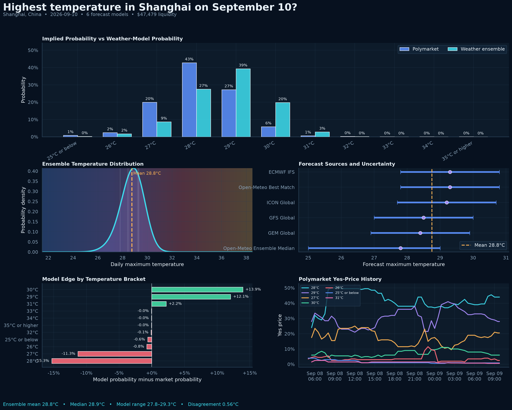
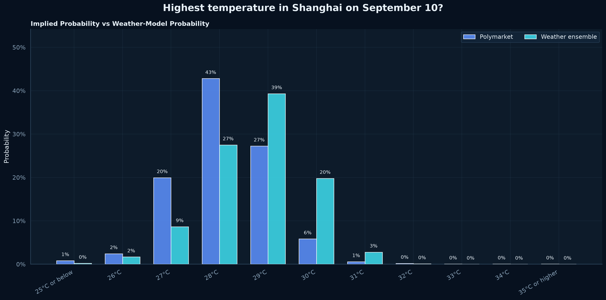
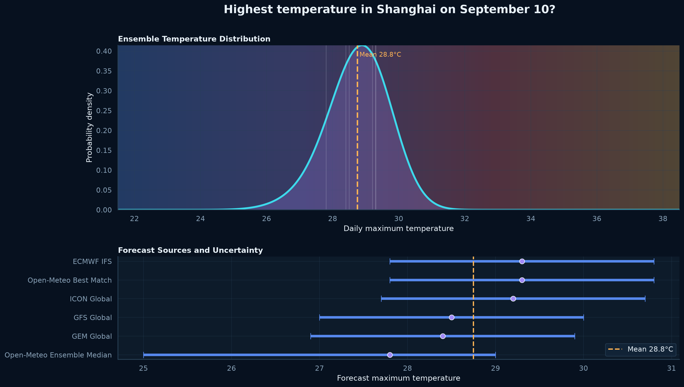
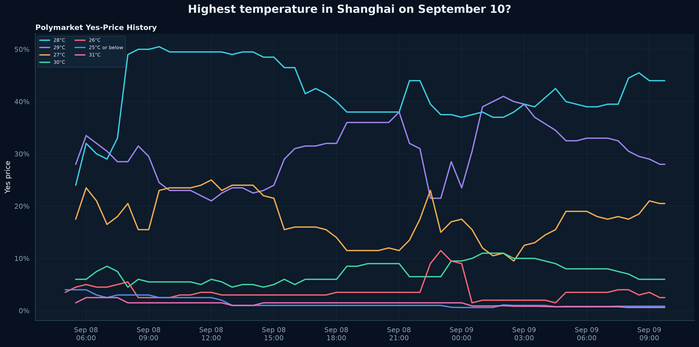
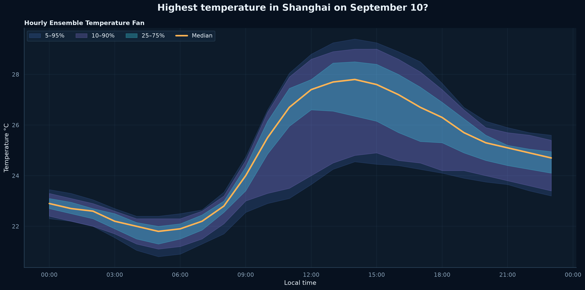
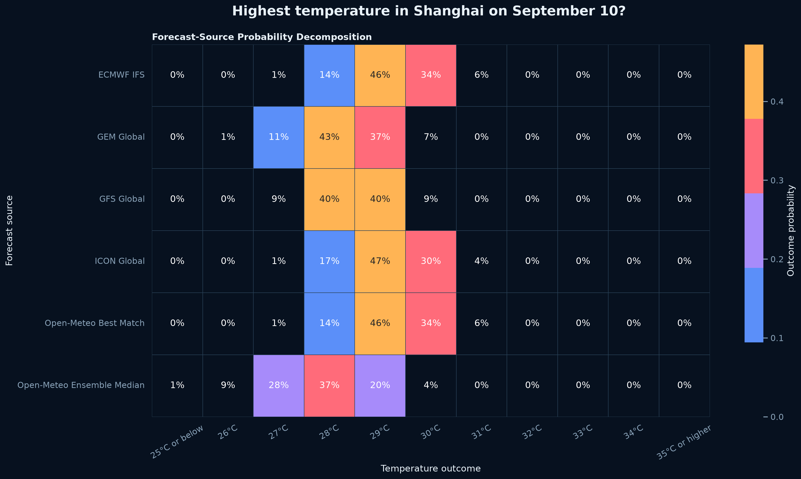
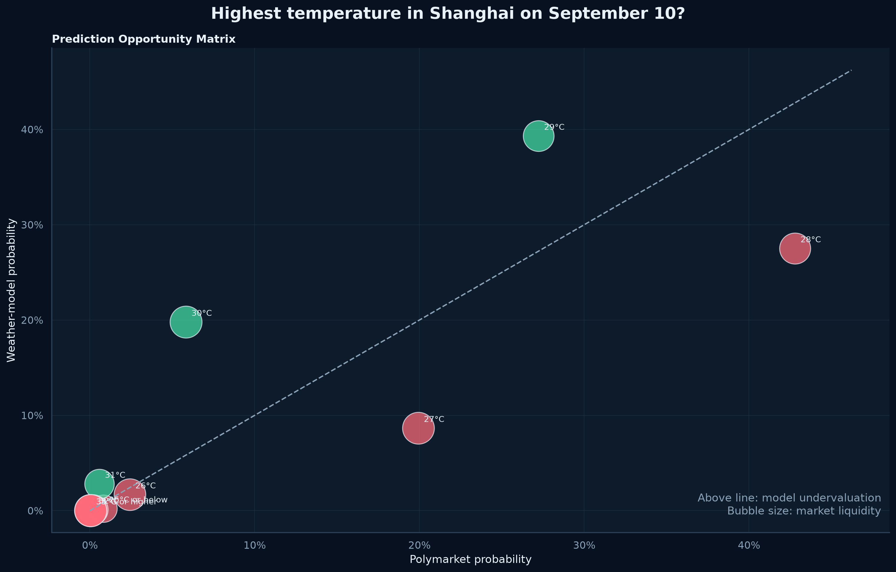
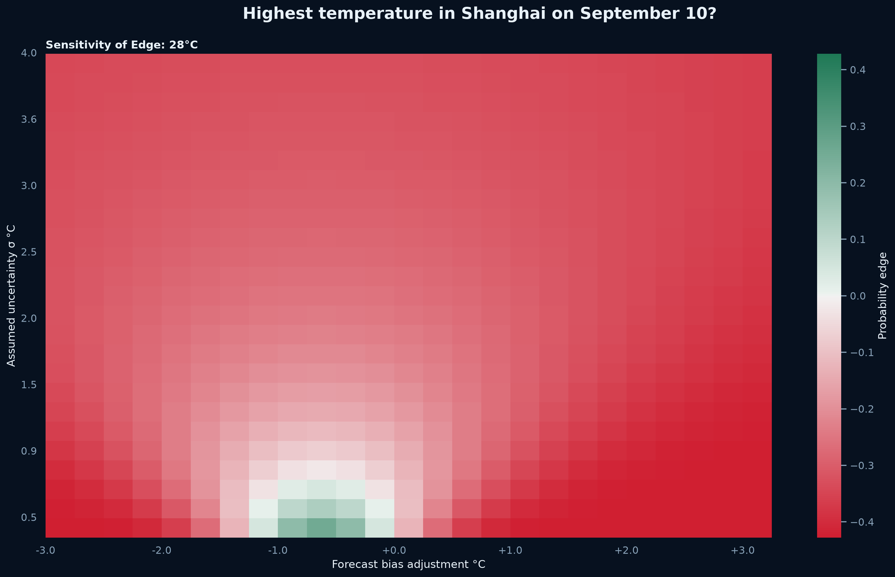
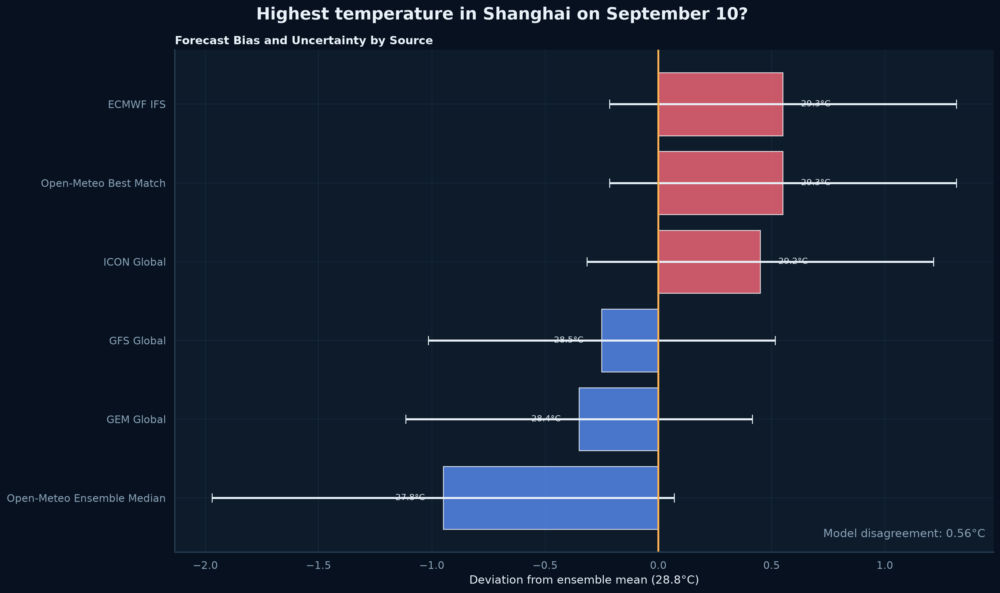

# Polymarket-weather-trading-bot-analysis
Polymarket weather trading bot Polymarket weather trading bot tutorial Polymarket weather bot strategy explained step by step best Polymarket weather trading bot tools and APIs Polymarket  automated weather trading bot for Polymarket.


# Using Poly Weather Analyzer Prediction Insights

> This guide explains how to interpret the terminal report, Markdown reports, visualizations, pricing edges, and forecast uncertainty.

## Contents

- [What the Analyzer Is For](#what-the-analyzer-is-for)
- [What It Is Not For](#what-it-is-not-for)
- [A Practical Analysis Workflow](#a-practical-analysis-workflow)
- [Reading the Terminal Report](#reading-the-terminal-report)
- [Reading the Dashboard](#reading-the-dashboard)
- [Reading Every Visualization](#reading-every-visualization)
- [Evaluating a Positive Edge](#evaluating-a-positive-edge)
- [Evaluating a Negative Edge](#evaluating-a-negative-edge)
- [Using the Reports](#using-the-reports)
- [Comparing Repeated Runs](#comparing-repeated-runs)
- [Resolution Risk](#resolution-risk)
- [Liquidity and Execution](#liquidity-and-execution)
- [Research Checklist](#research-checklist)

---

## What the Analyzer Is For

Poly Weather Analyzer is useful for:

- Comparing weather models
- Turning point forecasts into probabilities
- Measuring model disagreement
- Comparing meteorological probabilities with market prices
- Producing a structured weather-market thesis
- Creating charts for reports or research
- Screening markets for further investigation
- Monitoring forecast and price changes
- Building a larger automated weather-market system

The analyzer provides a consistent framework. Every event is processed through the same sequence of collection, normalization, modeling, and reporting.

---

## What It Is Not For

The analyzer is not:

- A guarantee of future temperature
- A substitute for reading resolution rules
- An automatic trading recommendation
- A complete execution engine
- A calibrated historical backtest
- A replacement for exact station forecasts
- A source of financial advice

> A probability estimate can be well calculated and still be wrong because its assumptions or inputs are wrong.

---

## A Practical Analysis Workflow

### Step 1: Read the market rules

Before running the program, identify:

- Resolution station
- Temperature unit
- Observation date
- Resolution precision
- Daily maximum definition
- Backup resolution source
- Time-zone rules
- Revision policy

### Step 2: Run the analyzer

```bash
python main.py highest-temperature-in-shanghai-on-september-10-2026
```

### Step 3: Check source coverage

A forecast based on one source should be treated differently from a forecast supported by many sources.

Look at:

- Number of sources
- Missing optional providers
- Presence of ensemble data
- NOAA availability for United States locations

### Step 4: Compare forecast locations

Confirm that the geocoded location is reasonably close to the official station.

### Step 5: Review model disagreement

Low disagreement means the sources have similar central forecasts.

High disagreement can indicate:

- Unstable weather
- Different model timing
- Geographic mismatches
- Conflicting numerical guidance
- Rapidly evolving conditions

### Step 6: Compare favorites

The terminal report displays:

- Weather-model favorite
- Polymarket favorite
- Whether they agree

Disagreement is a signal for investigation, not proof of mispricing.

### Step 7: Inspect sensitivity

A robust conclusion should survive reasonable changes in:

- Forecast mean
- Forecast bias
- Assumed standard deviation

### Step 8: Review liquidity and price history

A large modeled edge in a thin market may be difficult to execute.

### Step 9: Re-run after updates

Weather forecasts update several times per day. A static result becomes stale.

---

## Reading the Terminal Report

### Market overview

This section includes:

- Event ID
- Target date
- Forecast horizon
- Location
- Coordinates
- Time zone
- Elevation
- Forecast-source count
- Market count
- Liquidity
- Volume

Verify these fields before interpreting the prediction.

### Temperature forecast

This section reports:

| Metric | Meaning |
|---|---|
| Ensemble mean | Arithmetic average of source forecasts |
| Weighted mean | Forecast average weighted by estimated uncertainty |
| Ensemble median | Middle source forecast |
| Full range | Lowest through highest source forecast |
| Interquartile range | Middle 50% of source forecasts |
| Model disagreement | Standard deviation across source maximums |

A narrow range with low disagreement is usually more stable than a wide range with high disagreement.

### Prediction

The prediction section compares the leading outcome from:

- The weather model
- Polymarket prices

If the favorites disagree, determine whether the difference is caused by a meaningful shift or only a small probability gap.

### Confidence

Confidence is displayed as a score and four components.

Do not use the score alone. A high score may still hide:

- Shared model dependence
- Station mismatch
- Incorrect resolution interpretation
- Sudden weather changes

### Ranked opportunities

Each opportunity includes:

- Outcome label
- Market probability
- Model probability
- Probability edge
- Expected-value ratio
- Liquidity

The ranking is a research shortlist.

---

## Reading the Dashboard



The dashboard is the fastest overall view.

### Probability bars

Compare the Polymarket and weather-model bars.

Questions to ask:

- Which outcome has the largest disagreement?
- Is disagreement concentrated near the forecast center?
- Are tail outcomes materially different?
- Does the model distribution appear shifted warmer or colder?

### Ensemble density

The peak shows the most concentrated part of the modeled temperature distribution.

A broad curve indicates more uncertainty. A narrow curve indicates greater concentration.

### Source intervals

Each source has:

- A central maximum-temperature forecast
- A horizontal uncertainty interval

Look for outliers and clusters.

### Edge chart

Positive bars indicate model probability above market probability. Negative bars indicate market probability above model probability.

### Price history

Look for:

- Sudden probability changes
- Trend direction
- Mean reversion
- Recent volatility
- Whether weather-model changes appear reflected in price

---

## Reading Every Visualization

### Market vs Model Probabilities



Use this chart to identify the exact outcomes where model and market probabilities differ.

A large difference can be meaningful, but first inspect whether adjacent outcomes compensate for it. A small shift in the temperature mean can transfer substantial probability between neighboring whole-degree outcomes.

---

### Ensemble Distribution



Use this chart to understand:

- Distribution center
- Distribution width
- Source clustering
- Source outliers
- Uncertainty around the expected maximum

If the density peak lies close to a half-degree boundary, small forecast changes may shift the leading market outcome.

---

### Market Price History



Use price history to determine whether current disagreement is new.

Potential interpretations:

| Pattern | Possible Meaning |
|---|---|
| Model changed, market unchanged | Market may not have reacted yet |
| Market moved before model | Traders may have newer or different information |
| Both moved together | Forecast information may already be priced |
| Price sharply reversed | Thin liquidity or updated forecasts |
| No history | New or inactive market |

---

### Ensemble Fan Chart



The fan chart shows hourly uncertainty through the target day.

The daily maximum depends on the warmest hour, so inspect:

- Timing of the expected peak
- Width of the fan near the peak
- Whether members disagree on peak timing
- Whether late-day values remain elevated
- Whether the distribution becomes wider during heating hours

A narrow overnight band does not guarantee a narrow daily-maximum forecast if afternoon uncertainty is large.

---

### Source Probability Heatmap



Each row represents a forecast source. Each column represents a market outcome.

This chart reveals whether the combined probability comes from:

- Broad agreement
- A small group of warm sources
- A small group of cool sources
- One influential outlier
- Different uncertainty widths

A model favorite supported by nearly every source is more interpretable than one created by averaging two opposing clusters.

---

### Opportunity Matrix



The diagonal represents agreement:

\[
P_{\text{model}} = P_{\text{market}}
\]

Points above the diagonal have positive modeled edge. Points below the diagonal have negative modeled edge.

Bubble size represents liquidity.

The most interesting research candidates often have:

- Meaningful distance above the diagonal
- Reasonable liquidity
- Stable sensitivity
- Support from multiple sources
- Clear resolution rules

---

### Sensitivity Heatmap



The horizontal axis adjusts forecast bias. The vertical axis changes assumed uncertainty.

The chart answers:

> Would the modeled edge remain positive if the forecast were slightly warmer, cooler, or less certain?

A robust edge appears as a broad region with the same sign.

A fragile edge appears as a narrow region that changes sign quickly.

---

### Uncertainty Decomposition



Each bar shows a source's deviation from the ensemble mean. Error bars show estimated uncertainty.

Use this chart to identify:

- Warm-biased sources
- Cool-biased sources
- Large uncertainty intervals
- Tight source clusters
- Isolated outliers

Investigate outliers rather than automatically discarding them. An outlier may contain newer information, or it may be incorrect.

---

## Evaluating a Positive Edge

Suppose the model estimates:

```text
30°C model probability: 19.8%
30°C market probability: 5.8%
Probability edge: +14.0%
```

Before treating that difference as meaningful, ask:

1. Does the exact station forecast support 30°C?
2. Do most sources assign meaningful probability to 30°C?
3. Is the market price based on the current bid, ask, or last trade?
4. Is the result sensitive to a `0.5°C` forecast change?
5. Is the source uncertainty realistic?
6. Are fees and spread material?
7. Is sufficient liquidity available?
8. Has the market already moved?
9. Are newer model runs pending?
10. Could the resolution source round or report differently?

A positive edge is strongest when it is supported by multiple independent checks.

---

## Evaluating a Negative Edge

A negative edge means the market assigns more probability than the model.

Possible explanations include:

- Traders expect a warmer or cooler station bias
- Market participants have newer forecast runs
- The analyzer's location differs from the station
- The market is temporarily overpriced
- The modeled uncertainty is too narrow
- The model mixture underweights a relevant source
- A recent market trade is stale or unrepresentative

Negative edge can be as informative as positive edge because it reveals where the market's thesis differs from the forecast ensemble.

---

## Using the Reports

### Summary report

Open:

```text
output/event-986717-summary.md
```

Use it for:

- Quick event review
- Forecast consensus
- Probability table
- Liquidity and volume summary
- Sharing a compact analysis

### Prediction report

Open:

```text
output/event-986717-prediction.md
```

Use it for:

- Primary prediction
- Scenario analysis
- Ranked opportunities
- Confidence breakdown
- Machine-readable prediction details

### JSON analysis

Open:

```text
output/event-986717-analysis.json
```

Use it for:

- Further Python analysis
- Database ingestion
- Dashboard development
- Backtesting
- API integration
- Scheduled monitoring

---

## Comparing Repeated Runs

Forecast evolution is often more informative than one forecast snapshot.

Create separate run directories:

```bash
python main.py EVENT_SLUG --output runs/run-01
python main.py EVENT_SLUG --output runs/run-02
python main.py EVENT_SLUG --output runs/run-03
```

Compare:

| Metric | Why It Matters |
|---|---|
| Ensemble mean | Detects warmer or cooler forecast shifts |
| Model disagreement | Shows increasing or decreasing uncertainty |
| Leading outcome | Reveals bracket transitions |
| Model probability | Measures strengthening or weakening conviction |
| Market probability | Shows market reaction |
| Edge | Shows whether disagreement is closing |
| Price history | Provides context for current pricing |

A useful research log records the run time and major forecast changes.

---

## Resolution Risk

Weather markets are resolved according to written rules, not according to the analyzer's preferred data.

Always identify:

- Official station code
- Observation page
- Measurement column
- Local-day definition
- Rounding method
- Backup source
- Data revision cutoff
- Missing-data rule

A forecast for central Shanghai may differ from Shanghai Pudong International Airport. The official station determines the outcome.

---

## Liquidity and Execution

Market probability is not always executable at the displayed value.

Review:

- Best bid
- Best ask
- Spread
- Available size
- Minimum order size
- Fees
- Slippage
- Market restrictions

A model may estimate an attractive probability, but the executable ask may remove much of the apparent advantage.

Expected value should be recalculated using the actual execution price.

---

## Research Checklist

### Event validation

- [ ] Correct Polymarket event
- [ ] Correct observation date
- [ ] Correct temperature unit
- [ ] Correct resolution station
- [ ] Correct whole-degree boundaries
- [ ] Backup source understood

### Forecast validation

- [ ] Multiple sources available
- [ ] Local time zone correct
- [ ] Ensemble members available
- [ ] No obvious source parsing errors
- [ ] Forecast range is meteorologically plausible
- [ ] Outlier sources reviewed

### Probability validation

- [ ] Model favorite reviewed
- [ ] Market favorite reviewed
- [ ] Adjacent outcomes inspected
- [ ] Sensitivity chart reviewed
- [ ] Confidence components reviewed
- [ ] Tail probabilities appear plausible

### Market validation

- [ ] Current bid and ask reviewed
- [ ] Liquidity reviewed
- [ ] Volume reviewed
- [ ] Price history reviewed
- [ ] Fees considered
- [ ] Slippage considered

### Final review

- [ ] Forecast update time checked
- [ ] New model run timing checked
- [ ] Exact station conditions checked
- [ ] Analysis rerun after major updates
- [ ] Risk limits defined independently

> Use the analyzer to improve the structure of your reasoning, not to replace judgment.
